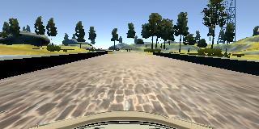

# Behavioral Cloning

The goals / steps of this project are the following:

 - Use the simulator to collect data of good driving behavior
 - Build, a convolution neural network in Keras that predicts steering angles from images
 - Train and validate the model with a training and validation set
 - Test that the model successfully drives around track one without leaving the road
 - Summarize the results with a written report
 
Here I will consider the [rubric points](https://review.udacity.com/#!/rubrics/432/view) individually and describe how I addressed each point in my implementation.

The project information is from the [Udacity link](https://github.com/udacity/CarND-Behavioral-Cloning-P3)

### Files Submitted & Code Quality

#### 1. Submission includes all required files and can be used to run the simulator in autonomous mode

My project includes the following files:

model.py containing the script to create and train the model
drive.py for driving the car in autonomous mode
model.h5 containing a trained convolution neural network
writeup_report.md or writeup_report.pdf summarizing the results
The ]youtube link](https://youtu.be/jxeJ4tIpH3Q) is below

#### 2. Submission includes functional code Using the Udacity provided simulator and drive.py file, the car can be driven autonomously around the track by executing

python drive.py model.h5

#### 3. Submission code is usable and readable

The model.py file contains the code for training and saving the convolution neural network. The file shows the pipeline I used for training and validating the model, and it contains comments to explain how the code works.

### Model Architecture and Training Strategy

#### 1. An appropriate model architecture has been employed

The model is based from the [Nvidia End-to-End Learning for Self-Driving Cars](https://images.nvidia.com/content/tegra/automotive/images/2016/solutions/pdf/end-to-end-dl-using-px.pdf) , with minor changes like 'ELU' is used as activation instead of 'RELU' and use for Dropout in FNN to avoid overfitting.

Here is my model.summary output:

|Layer (type)                     |Output Shape          |Param #     |Connected to                    |
|---------------------------------|:--------------------:|:----------:|:------------------------------:|
|BatchNormalization               |(None, 66, 200, 3)    |12          |batchnormalization_input_1[0][0]|
|Convolution2D                    |(None, 31, 98, 24)    |1824        |batchnormalization_1[0][0]      |
|Activation                       |(None, 31, 98, 24)    |0           |convolution2d_1[0][0]           |
|Convolution2D                    |(None, 14, 47, 36)    |21636       |activation_1[0][0]              |
|Activation                       |(None, 14, 47, 36)    |0           |convolution2d_2[0][0]           |
|Convolution2D                    |(None, 6, 23, 48)     |15600       |activation_2[0][0]              |
|Activation                       |(None, 6, 23, 48)     |0           |convolution2d_3[0][0]           |
|Convolution2D                    |(None, 4, 21, 64)     |27712       |activation_3[0][0]              |
|Activation                       |(None, 4, 21, 64)     |0           |convolution2d_4[0][0]           |
|Convolution2D                    |(None, 2, 19, 64)     |36928       |activation_4[0][0]              |
|Activation                       |(None, 2, 19, 64)     |0           |convolution2d_5[0][0]           |
|Flatten                          |(None, 2432)          |0           |activation_5[0][0]              |
|Dense                            |(None, 1164)          |2832012     |flatten_1[0][0]                 |
|Activation                       |(None, 1164)          |0           |dense_1[0][0]                   |
|Dropout                          |(None, 1164)          |0           |activation_6[0][0]              |
|Dense                            |(None, 100)           |116500      |dropout_1[0][0]                 |
|Activation                       |(None, 100)           |0           |dense_2[0][0]                   |
|Dropout                          |(None, 100)           |0           |activation_7[0][0]              |
|Dense                            |(None, 50)            |5050        |dropout_2[0][0]                 |
|Activation                       |(None, 50)            |0           |dense_3[0][0]                   |
|Dropout                          |(None, 50)            |0           |activation_8[0][0]              |
|Dense                            |(None, 10)            |510         |dropout_3[0][0]                 |
|Activation                       |(None, 10)            |0           |dense_4[0][0]                   |
|Dropout                          |(None, 10)            |0           |activation_9[0][0]              | 
|Dense                            |(None, 1)             |11          |dropout_4[0][0]                 |
|Activation                       |(None, 1)             |0           |dense_5[0][0]                   |
|                                 |                      |3,057,795   |                                |

#### 2. Attempts to reduce overfitting in the model

The model contains dropout layers (4 in total with 50% dropout percent) for every FNN(Fully connected Neural Network) in order to reduce overfitting (model.py).

#### 3. Model parameter tuning

The model used an adam optimizer with following parameters:
learning_rate = 0.0001, beta_1=0.9, beta_2=0.999, epsilon=1e-08, decay=0.0
Learning Rate was along tuned manually with different values.

#### 4. Appropriate training data

1. Training data was chosen to keep the vehicle driving on the road. Udacity provided data is used and additional data is recorded for recovery and left and right images are used with compensation for the camera angle (+/-0.08).

2. The training vs Validation is 90-10 % split and data is shuffled every call.

3. for data augmentation, Images are flipped left to right and steering angle is negated for the same.

4. Image is cropped from on the top and on the bottom to eliminate the sky and car bonnet part.

Centre Image (160 x 320)

Trimmed Image (80 x 320)  

5. Image is then resized to 66 x 200 (This is not required, but it helps to make the execution faster since the size is reduced without much loss).

6. Also images are moved form RGB to YUV plane for complying with the Nvidia paper.(Even in RGB plane it's possible to train)

7. Different batch_size and epochs were tried. Final value chosen were batch_size = 240 and epochs = 75.

8. fit_generator is used to load images into the Training model.

9. The output MSE graph is 

### Changes to drive.py

1. The PI controller is slightly changed to have increased Kp and Ki values. (drive.py line no:75)

2. Similarly the input image is clipped from 160 x 320 to 80 x 320 and converted from RGB 2 YUV plane. (drive.py line no:65 - 68)
